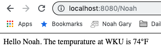

# goWeb

This is a repo containing my experiements in writing a webscrapper and webserver using go and go Html Templates

## Getting Started

To start the code you will want to update your GOPATH and PATH like so:

```
GOPATH="Path/to/goWeb"
PATH="Path/to/goWeb:$PATH"
```

also assure you have go installed correctly and you have your GOROOT set:

```
GOROOT="/usr/local/go"
```

Then build the packages:

```
cd Path/to/goWeb
go build src/getWkuTemp/getWkuTemp.go
go build src/tempAtWKU/tempAtWKU.go
go build src/webscraper/webscraper.go
```

To host the go webserver and serve the current temperature:

```
./src/tempAtWKU
```

Then navigate to:

```
http://localhost:8080/[YourName]
```

This should display a webpage that looks something like this:


